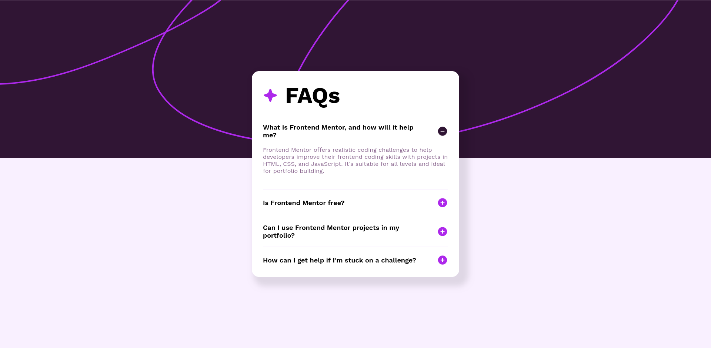

# Frontend Mentor - FAQ accordion

Projeto desenvolvido do desafio frontend mentor que se tratar de um FAQ accordion(Perguntas frequentes), feito em HTML,CSS e JS.

## Demonstração

### **EXPECTATIVA**

### **REALIDADE**

**Have fun building!** 🚀👩🏽‍💻​
